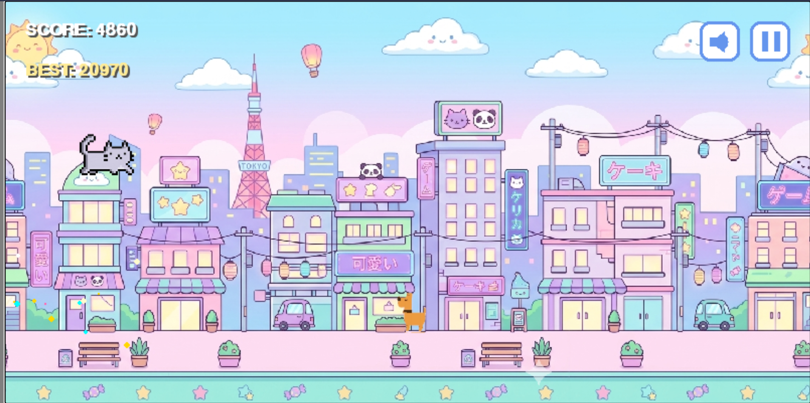

# 🦖 DevDino Run 

A fast-paced, "cute" endless runner built entirely in **Python** using the **Pygame** library. This project was a personal challenge to go from "zero to game" in a single 8.5-hour sprint!

## 🚀 The Journey
- **The Sprint:** 8.5 hours of non-stop coding to get the core mechanics working.
- **The Wall:** Spent 2 days overcoming the logic for a persistent leaderboard.
- **The Goal:** Purely for learning game development fundamentals and logic building.

## 🎮 Features
- **Smooth Mechanics:** Gravity-based jumping and obstacle collision.
- **Leaderboard:** High-score tracking (the hardest part of the build!).
- **Indie Polish:** Sound toggles, screen shakes, and custom animations.
- **Mobile Friendly:** Designed to be playable on multiple platforms.

## 🛠️ Tech Stack
- **Language:** Python 3.x
- **Library:** Pygame
- **Logic:** Asyncio for web-compatibility

## 📸 Screenshots

## 🏃 How to Run
1. Make sure you have Python installed.
2. Install Pygame: `pip install pygame`
3. Run the game: `python main.py`

---
#GameDev #Python #Pygame #BTech #LearningByDoing
